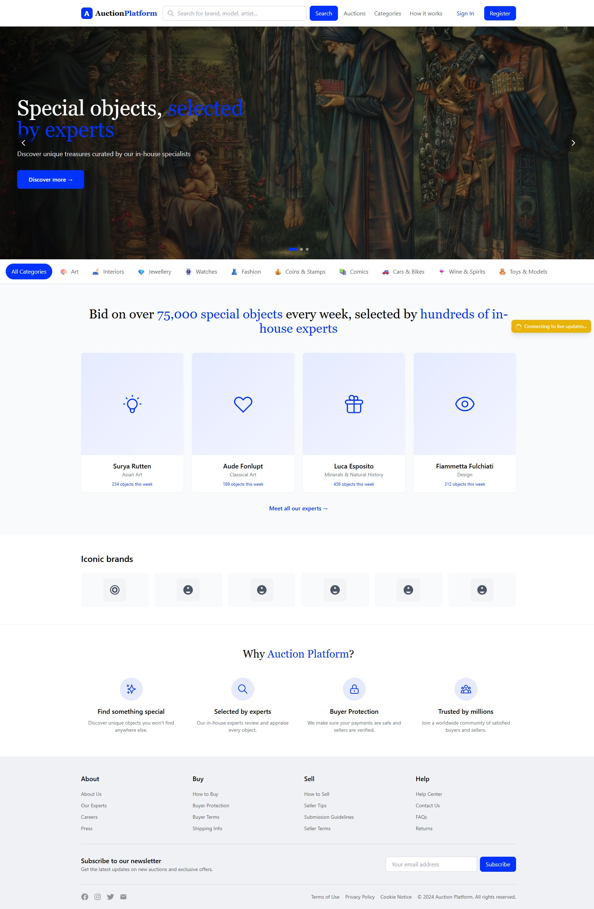

# Auction Platform - Complete Documentation

## 🚀 Quick Start

### Prerequisites
- Node.js 18+
- PostgreSQL 15+
- Redis 7+
- Docker (optional)

## Screenshots

## Homepage



### Installation

```bash
# Clone the repository
git clone <your-repo-url>
cd auction-platform

# Install backend dependencies
cd backend
npm install

# Install frontend dependencies
cd ../frontend
npm install

# Set up environment variables
cp backend/.env.example backend/.env
# Edit .env with your database credentials

# Create database
# Using psql command line
psql -U postgres -c "CREATE DATABASE auction_platform;"

# Or if you have PostgreSQL in PATH
createdb -U postgres auction_platform

# Run migrations
cd backend
npm run migrate

# Seed database
npm run seed

# Start backend
npm run dev

# In another terminal, start frontend
cd frontend
npm run dev


